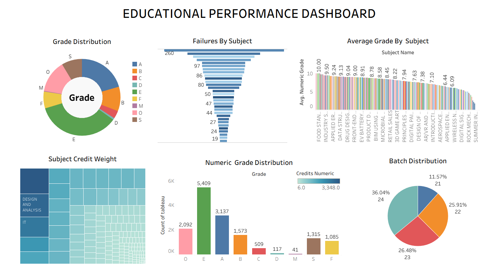
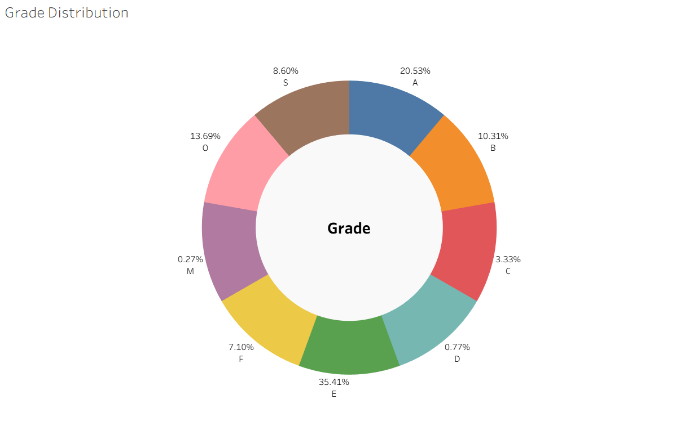
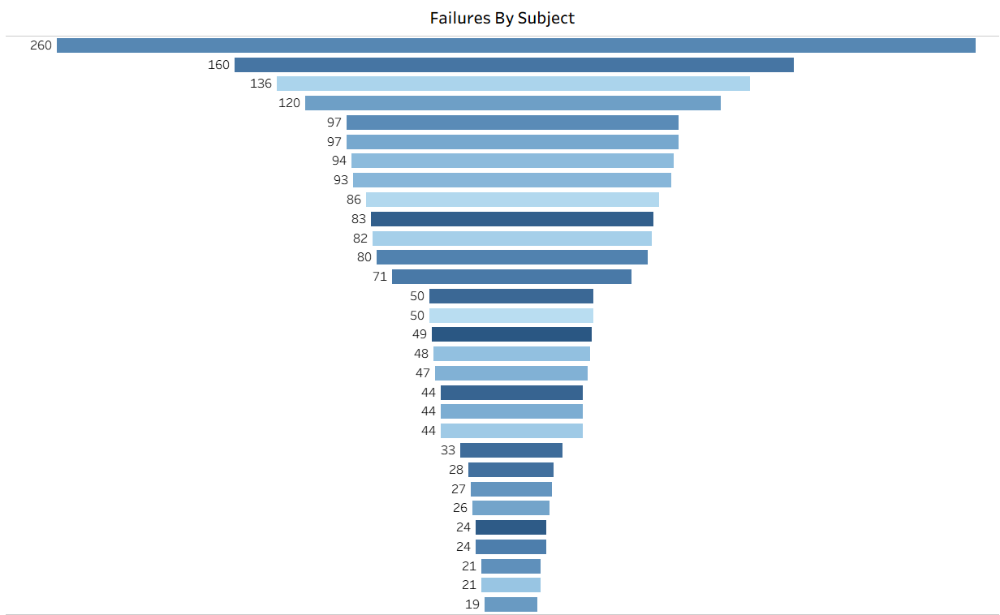
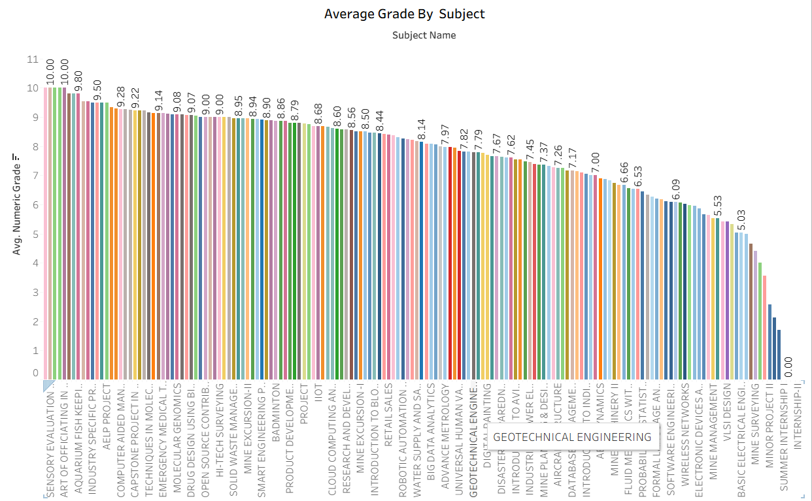
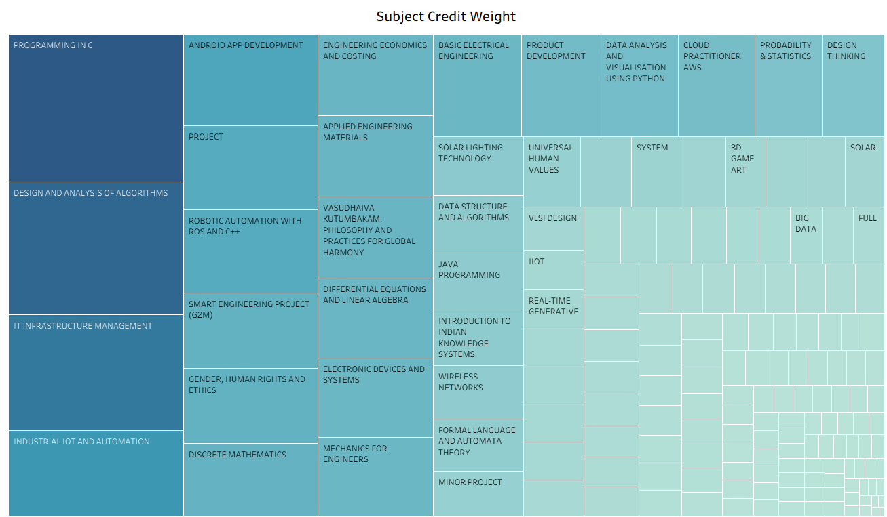
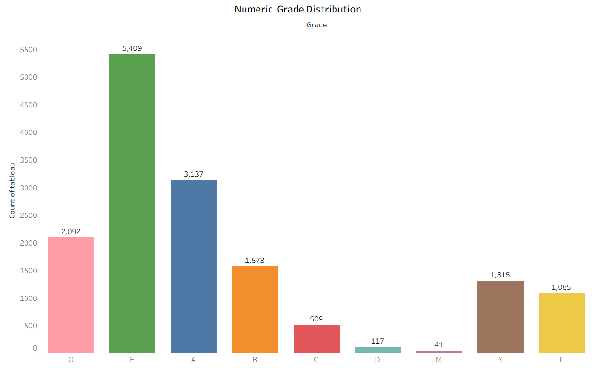
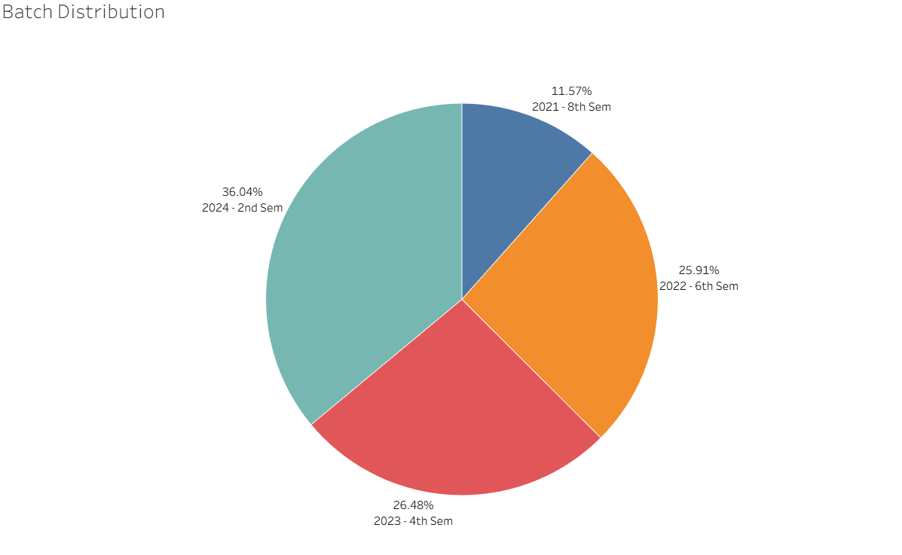
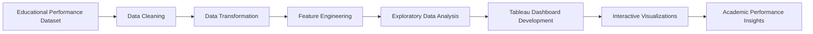

# Educational Performance Dashboard

An interactive Tableau dashboard that transforms raw academic records into meaningful visual insights, enabling educators and institutions to analyze student performance, identify academic trends, monitor subject-wise outcomes, and support data-driven decision-making.


## Table of Contents

- [About the Project](#about-the-project)
- [Problem Statement](#problem-statement)
- [Objectives](#objectives)
- [Tech Stack](#tech-stack)
- [Dataset Overview](#dataset-overview)
- [Dashboard Preview](#dashboard-preview)
- [Dashboard Components](#dashboard-components)
- [Key Insights](#key-insights)
- [Project Impact](#project-impact)
- [Project Workflow](#project-workflow)
- [Repository Structure](#repository-structure)
- [Future Improvements](#future-improvements)
- [Author](#author)

## Dashboard Preview

<p align="center">
  
</p>

## About the Project

Educational institutions generate vast amounts of academic data every semester, including student grades, subject performance, credit information, and batch-wise records. While this data is valuable for evaluating academic outcomes, extracting meaningful insights from spreadsheets or raw datasets can be time-consuming and challenging.

This project presents an **Educational Performance Dashboard** developed using **Tableau** to transform raw academic records into interactive visualizations that simplify educational data analysis. By integrating multiple analytical perspectives into a single dashboard, the project enables users to explore grade distributions, evaluate subject-wise performance, identify courses with high failure rates, analyze credit weight distribution, and compare student performance across different batches.

Built on a dataset containing **15,000+ academic records** spanning multiple subjects and batches, the dashboard provides a centralized platform for monitoring institutional performance through interactive charts and data-driven insights. The visualizations help educators and academic administrators identify learning trends, recognize subjects requiring additional attention, and support informed decision-making for curriculum planning and student performance evaluation.

Rather than presenting raw statistics, the dashboard transforms complex educational data into an intuitive analytics platform that promotes better understanding of academic outcomes and institutional performance.

## Problem Statement

Educational institutions collect extensive academic data, including student grades, subject performance, credit information, and batch-wise records. However, this data is often maintained in spreadsheets or institutional databases, making it difficult to efficiently analyze performance trends, identify challenging subjects, and evaluate overall academic outcomes.

Without a centralized analytical platform, educators and administrators must manually generate reports to compare grades, monitor failure rates, and assess subject performance. This process is time-consuming, prone to errors, and limits the ability to make timely, data-driven academic decisions.

This project addresses these challenges by developing an interactive Tableau dashboard that consolidates academic data into a unified visualization platform. Through intuitive charts and interactive dashboards, users can analyze grade distributions, identify subjects with high failure rates, evaluate average performance across subjects, examine credit weight distribution, and compare academic trends across different student batches. The dashboard enables faster insight generation and supports informed decision-making for curriculum planning, student performance evaluation, and institutional improvement.

## Objectives

The primary objective of this project is to develop an interactive Tableau dashboard that transforms raw academic data into meaningful visual insights, enabling educational institutions to evaluate student performance and support data-driven decision-making.

The project aims to:

- Analyze the distribution of student grades to understand overall academic performance.
- Identify subjects with high failure rates to highlight areas requiring academic intervention.
- Compare average performance across subjects using numeric grade analysis.
- Visualize subject credit distribution to understand curriculum weightage and course importance.
- Examine batch-wise student distribution to identify academic and enrollment trends.
- Build an interactive dashboard that consolidates multiple performance indicators into a single analytical platform.
- Enable educators and administrators to explore academic data efficiently through intuitive visualizations and interactive analytics.

## Tech Stack

| Category | Technologies / Tools |
|----------|----------------------|
| **Data Visualization** | Tableau Desktop |
| **Data Source** | Microsoft Excel (.xlsx) |
| **Data Preparation** | Data Cleaning, Data Transformation, Feature Engineering |
| **Data Analysis** | Exploratory Data Analysis (EDA), Descriptive Analytics |
| **Dashboard Components** | KPI Cards, Interactive Filters, Tooltips, Legends |
| **Visualization Techniques** | Donut Chart, Bar Chart, Funnel Chart, Treemap, Pie Chart |
| **Domain** | Educational Analytics |

<p align="center">


</p>

## Dataset Overview

The dashboard is built using an educational performance dataset containing **15,278 student–subject records**, where each record represents a student's performance in a specific academic subject. The dataset captures academic outcomes across multiple batches, subjects, course types, and credit structures, providing a comprehensive view of institutional performance.

The data was collected from institutional academic records and prepared for analysis through data cleaning, transformation, and feature engineering before being imported into Tableau for visualization.

### Dataset Summary

| Attribute | Details |
|----------|---------|
| **Total Records** | 15,278 |
| **Primary Entity** | Student–Subject Performance Record |
| **Data Source** | Institutional Academic Records (Excel) |
| **File Format** | Microsoft Excel (.xlsx) |
| **Domain** | Educational Analytics |

### Key Attributes

| Attribute | Description |
|----------|-------------|
| **Reg_No** | Unique student registration number |
| **Name** | Student name |
| **Subject_Code** | Unique identifier for each subject |
| **Subject_Name** | Name of the academic subject |
| **Type** | Subject category (Theory, Practical, Project, etc.) |
| **Credits** | Credit allocation for each subject |
| **Grade** | Letter grade obtained by the student |

### Data Preparation

Before developing the dashboard, the dataset underwent several preprocessing steps to ensure analytical accuracy and consistency:

- Cleaned and validated academic records by handling missing values and inconsistencies.
- Standardized subject names, grade labels, and credit formats for uniform analysis.
- Converted academic data into Tableau-compatible formats for visualization.
- Created calculated fields and derived metrics, including **Numeric Grade**, **Failure Indicator**, and **Credit-based aggregations**, to enable advanced performance analysis.


## Dashboard Preview

The **Educational Performance Dashboard** consolidates multiple academic performance indicators into a single interactive interface, enabling users to analyze grade distributions, subject-wise performance, failure trends, credit allocation, and batch-wise academic statistics. The dashboard is designed to provide educators and administrators with a comprehensive overview of institutional performance through intuitive visualizations and interactive exploration.

<p align="center">
  
</p>

### Dashboard Highlights

- Interactive analysis of **15,278+ student-subject performance records**
- Six integrated visualizations covering academic performance from multiple perspectives
- Interactive filtering and exploration using Tableau
- Quick identification of high-performing and high-risk subjects
- Comparative analysis across grades, subjects, credits, and academic batches

## Dashboard Components

The dashboard integrates six interactive visualizations, each focusing on a different aspect of educational performance. Together, these components provide a comprehensive view of academic outcomes, helping educators identify trends, evaluate subject performance, and make informed decisions.

---

### 1. Grade Distribution

<p align="center">
  
</p>

**Description**

This donut chart illustrates the overall distribution of student grades across the institution. It provides a high-level overview of academic performance by showing the proportion of students in each grade category.

**Key Insight**

The visualization reveals that grades **E** and **A** represent the largest share of the dataset, highlighting the overall academic performance pattern and enabling quick identification of grade concentration.

---

### 2. Failures by Subject

<p align="center">
  
</p>

**Description**

The funnel chart ranks subjects based on the total number of student failures, allowing educators to identify courses where students face the greatest academic challenges.

**Key Insight**

Subjects such as **Android App Development**, **Applied Engineering**, and **Basic Electrical Engineering** recorded the highest number of failures, indicating potential areas for curriculum review and targeted academic support.

---

### 3. Average Grade by Subject

<p align="center">
  
</p>

**Description**

This horizontal bar chart compares the average numeric grade achieved in each subject, enabling performance evaluation across the curriculum.

**Key Insight**

Subjects such as **Sensory Evaluation** and **Art of Officiating** achieved the highest average grades, while several technical subjects recorded comparatively lower averages, highlighting variations in subject-level performance.

---

### 4. Subject Credit Weight

<p align="center">
  
</p>

**Description**

The treemap visualizes the academic credit allocation for each subject. Larger blocks represent subjects carrying higher academic weight within the curriculum.

**Key Insight**

Core engineering subjects such as **Programming in C**, **Design and Analysis of Algorithms**, and **IT Infrastructure Management** contribute the highest credit weight, emphasizing their significance in the overall academic structure.

---

### 5. Numeric Grade Distribution

<p align="center">
  
</p>

**Description**

This bar chart presents the frequency of numeric grade values, offering a more detailed statistical view of academic performance than categorical grades alone.

**Key Insight**

The chart highlights that lower numeric grades occur most frequently, providing valuable insight into overall performance distribution and helping identify areas where academic improvement initiatives may be beneficial.

---

### 6. Batch Distribution

<p align="center">
  
</p>

**Description**

The pie chart illustrates the proportion of academic records belonging to each student batch, enabling comparison of participation across different academic years.

**Key Insight**

**Batch 2024** accounts for the largest share of records, followed by **2023** and **2022**, indicating greater student representation in the more recent academic batches.

---


## Key Insights

The dashboard uncovers several meaningful patterns in student academic performance, enabling educators and administrators to make informed, data-driven decisions.

- **Grade Distribution:** The majority of students fall within the **E** and **A** grade categories, providing an overall snapshot of institutional academic performance and grade concentration.

- **Subject Difficulty:** Subjects such as **Android App Development**, **Applied Engineering**, and **Basic Electrical Engineering** recorded the highest failure counts, highlighting areas where additional academic support or curriculum improvements may be required.

- **Academic Performance:** Subject-wise average grade analysis reveals noticeable variation in student performance, helping identify courses with consistently strong outcomes as well as subjects requiring focused intervention.

- **Curriculum Weightage:** Core engineering courses contribute the highest academic credit weight, allowing educators to compare course importance alongside student performance and workload distribution.

- **Batch-wise Analysis:** Recent academic batches, particularly **2024**, account for the largest proportion of student records, providing insights into enrollment trends and institutional growth.

- **Interactive Analytics:** By consolidating multiple visualizations into a unified dashboard with interactive exploration capabilities, the project enables faster performance analysis, supports curriculum planning, and facilitates evidence-based academic decision-making.


## Project Impact

The **Educational Performance Dashboard** transforms over **15,000 academic records** into an interactive decision-support system that enables educators and administrators to evaluate institutional performance more efficiently. By replacing manual spreadsheet-based analysis with intuitive visualizations, the dashboard simplifies the process of identifying academic trends, monitoring student outcomes, and comparing subject-level performance.

The insights generated through the dashboard can support educational institutions in:

- Identifying subjects with consistently high failure rates that require curriculum review or additional academic support.
- Monitoring overall grade distribution to evaluate institutional academic performance.
- Comparing subject-wise average grades to assess teaching effectiveness and learning outcomes.
- Understanding curriculum structure through credit-weight analysis and balancing academic workload.
- Tracking batch-wise academic trends to support institutional planning and resource allocation.
- Accelerating academic reporting through interactive visualizations, reducing the time required to analyze large educational datasets.
- Promoting data-driven decision-making for curriculum improvement, student mentoring, and continuous institutional development.


## Project Workflow

The project follows a structured analytics workflow, transforming raw academic records into an interactive educational dashboard through systematic data preparation, analysis, and visualization.



### Workflow Stages

#### 1. Data Collection
- Imported an educational performance dataset containing **15,278 student-subject records** with information on grades, subjects, credits, and batches.

#### 2. Data Cleaning
- Validated the dataset by handling inconsistencies, standardizing subject names, grade labels, and credit formats to ensure reliable analysis.

#### 3. Data Transformation
- Structured the dataset into an analysis-ready format and prepared fields for visualization within Tableau.

#### 4. Feature Engineering
- Created derived metrics such as **Numeric Grade**, **Failure Indicator**, and **Credit-based aggregations** to support deeper performance analysis.

#### 5. Exploratory Data Analysis
- Explored grade distributions, subject performance, failure patterns, credit allocation, and batch-wise trends to identify meaningful relationships within the data.

#### 6. Dashboard Development
- Designed interactive Tableau dashboards using **Donut Charts**, **Bar Charts**, **Funnel Charts**, **Treemaps**, and **Pie Charts** to present multiple dimensions of educational performance.

#### 7. Insight Generation
- Derived actionable insights related to academic performance, subject difficulty, curriculum weightage, and institutional trends, enabling data-driven educational planning and decision-making.


## Repository Structure

```text
educational-performance-dashboard/
│
├── README.md
├── LICENSE
├── .gitignore
│
├── dashboard/
│   └── Educational_Performance_Dashboard.twbx
│
├── data/
│   └── Educational Performance Dataset.xlsx
│
├── images/
│   ├── dashboard.png
│   ├── grade-distribution.png
│   ├── failures-by-subject.png
│   ├── average-grade-by-subject.png
│   ├── credit-weight.png
│   ├── numeric-grade-distribution.png
│   └── batch-distribution.png
│
├── report/
│   └── Educational Performance Dashboard Report.pdf
│
└── docs/
    └── methodology.md
```


## Future Improvements

While the current dashboard provides comprehensive descriptive insights into academic performance, several enhancements can further extend its analytical capabilities and practical value.

- **Real-time Data Integration** – Connect the dashboard to institutional databases or Learning Management Systems (LMS) for automatic data updates and real-time monitoring.

- **Predictive Analytics** – Integrate machine learning models to predict student performance, identify at-risk students, and forecast subject-wise outcomes.

- **Advanced Filtering & Drill-down** – Introduce additional filters such as department, semester, course type, and instructor to enable deeper performance analysis.

- **Interactive Web Deployment** – Publish the dashboard through **Tableau Public** or **Tableau Server** to improve accessibility and collaboration.

- **Automated Reporting** – Generate scheduled reports and performance summaries for faculty members and academic administrators.

- **Institutional Benchmarking** – Compare academic performance across multiple departments, programs, or institutions to support strategic planning.

- **Student Performance Monitoring** – Develop personalized dashboards for tracking individual student progress and recommending academic interventions.


## Author

**Jnanaranjan Pati**

Computer Science Engineering Student | AI & ML Enthusiast | Data Analytics

- **GitHub:** https://github.com/JnanaranjanPati
- **LinkedIn:** https://www.linkedin.com/in/jnanaranjan005/

If you found this project interesting, consider giving the repository a ⭐.


